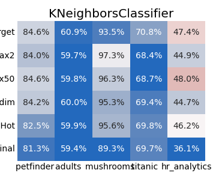
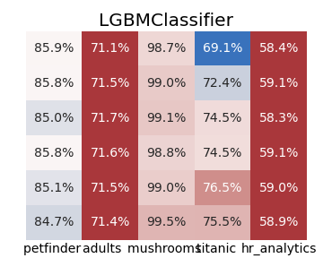
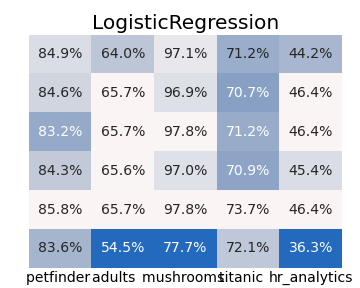
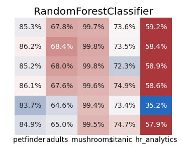

# Benchmarking Categorical Feature Encoding Techniques
## 1. Goal
> **What is the best way to encode categorical features in a structured dataset?**

This benchmarking pipeline hopes to help shed some light on this broad question. We evaluate here the performance of several encoding techniques commonly used to turn categorical features into numerical ones within structured datasets. The benchmark is run across multiple binary classification tasks, and considers multiple types of downstream classifiers. Scoring is focused on Accuracy, F1-score and AUC.  
*Note*: The focus of this project is solely on comparing categorical encoding techniques. It is not our ambition here to achieve state-of-the-art on any of the specific tasks, nor to optimize feature selection, feature engineering or classifiers' hyper-parameters.

## 2. Categorical Encoding Techniques 
### 2.1 Baseline 1: One Hot Encoding (OHE)
Probably the most commonly used technique. OHE consists in creating a new binary feature for each categorical unique value. 
It provides quite a bit of flexibility for the downstream classifier to learn from the dataset, but at the expense of a very high dimensionality and sparse transformation of the input features ($\sum_fcardinality(f)$).
* Implementation: `sklearn.preprocessing.OneHotEncoder`

### 2.2 Baseline 2: Ordinal Encoding
Ordinal Encoding simply replaces categorical values with integers, based on alphabetical order. Its transformation preserves the inputs dimensionality but the numerical representation is quite "naive".
* Implementation: `sklearn.preprocessing.OrdinalEncoder`

### 2.3 Mean Target Encoding (MTE)
**Mean Target Encoding (MTE)** also preserves the input's dimensionality but replaces the categorical value by the mean target value for all observations belonging to that category. 
* Implementation: **CUSTOM**: [`columnar.encode.MeanTargetEncoder`](./src/columnar/encode.py)

### 2.4 Categorical Feature Embeddings
**Categorical feature embeddings** are a potentially more expressive generalization of MTE which represents each categorical value as an embedding. embeddings sizes can be defined based on the cardinality of each feature. An embedding of size 1 should replicate closely the principle of MTE, but weights are learnt instead of explicitly defined.
We considered in this project 3 embedding sizing strategies (referred through the class ). For any categorical feature $f$, the embedding dimensionality can be defined as:

| `EmbSizeStrategyName` | definition |
|:----:|:---|
| `single`| $dim_{emb}(f)=1$ |
| `max50` | $dim_{emb}(f)=min(50,cardinality(f)// 2)$ |
| `max2` | $dim_{emb}(f)=min(2,cardinality(f)//2)$|

* Implementation: **CUSTOM**: [`columnar.embeddings.wrapper.TFEmbeddingWrapper`](./src/columnar/embeddings/wrapper.py)
---
## 3. Tasks

### 3.1 Adult Dataset
Predict whether an adult's income is higher or lower than $50k, using census information given 15 census information.
https://archive.ics.uci.edu/ml/datasets/Adult

### 3.2 Mushrooms Dataset
Aims to predict whether a mushroom is poisonous given 23 categorical descriptors.  
https://www.kaggle.com/uciml/mushroom-classification#

### 3.3 Titanic Dataset
Aims to predict whether a Titanic passenger survived given a few descriptors. only some minimal imputing and feature engineering was performed.
https://www.kaggle.com/uciml/mushroom-classification#

### 3.4 HR Analytics Dataset
Aims to predict whether a data scientist is looking for a job change or not. only some minimal imputing and feature engineering was performed.
https://www.kaggle.com/arashnic/hr-analytics-job-change-of-data-scientists

### 3.5 PetFinder
Aims to predict whether a pet will be adopted within a 100 days.
https://www.kaggle.com/c/petfinder-adoption-prediction/data

---
## 4. Benchmarking strategy
A ML Pipeline is built with each categorical encoder / classifier pairs, and trained on the task at hand. Evaluation is performed through a 5-fold cross validation strategy, to extract mean and std dev values for each metric of interest.   
**Pipeline Overview**
*`*` sklearn component*  *`**` LightGBM component*  
*other components were built specifically for this project (cf [src/columnar](src/columar))*

---
## 5. Main Findings
### 5.1 F1-score comparison
KNeighborsClassifier                          | LGBMClassifier                               | LogisticRegression | RandomForestClassifier
:--------------------------------------------:|:---------------------------------------:|:------------------:|:--------------------------------------------:|
 |  |  | 

#### Description 
* Each heatmap represents the F1-score obtained with a classifier for a given task (x-axis) and with a given categorical encoding technique (y-axis).
* color coding uses the OneHotEncoding + LogisticRegression score as a baseline for each task. Red values indicate performance superior to baseline, while blue values indicate lower performance.

#### Findings
- Some classifiers are more sensitive to the encoding technique than others. LGBM from that perspective offers both the benefits of limited sensitivity and high level performance.
- **Ordinal Encoders** are, understanbly, performing poorly for linear classifiers that rely on topological distance for training and predictions (KNN, LogisticRegression). Both Mean-Target Encoding and unidimensional embeddings therefore allow to significantly improve performance for those models without increasing the input's dimensionality after transformation.
- **One Hot Encoders** tend to work well for LogisticRegressions. On the other hand, it consistently performs poorly when used in conjunction with RandomForests.

### 5.2 All results 

The below charts provide more detailed results at the task level, including standard deviation observed for each metric for each encoder / classifier pairs.
**Adult Task** 
**Mushrooms Task** 
**Titanic Task** 
**HR Analytics Task** 
**PetFinder** 
---
## 6. Install Requirements
`conda install -n <name> -f conda.yml`

---
## 7. Reproducing Experiments
### 7.1 through Scripts
the user can simply run the following command:  
  
  `python main.py --task <task_name> [-c config.yml]`  
  
This command will evaluate the performance of various encoder / classifier combinations and generate:
- a CSV report in the `reports/` folder
- a summary figure in the `figures/` folder.
Both new artifacts are named after the prediction task used to evaluate the pipelines.

All core configuration parameters to run the benchmark can be found and edited in the `config.yml` file.

### 7.2 using a Streamlit App
Allows to run the benchmark while selecting:
- which task to use for benchmarking
- the type of downstream classifiers
- the encoders to benchmark against

to do so, you can simply run the command:  
    `streamlit run streamlit.py`

### 7.3 the Notebook way
check out [notebooks/adult](notebooks/adult.ipynb).

---
## 8. Benchmarking on a Different task
Any binary classification task can be used to evaluate encoder/model pairs as long as the dataset is made available in the `data/` folder, and an identically named python file is added in `src/columnar/loaders`. this file must include 2 functions:
- `_load` describes the steps to load the dataset in memory
- `_select_features(df)` builds a FeatureSelection object describing which features will be fed into the classifier, which ones are categorical, and which column corresponds to the target.

Once this is done, the user can simply run the following command:  
  
  `python main.py --task <new_task_name>`  

You can find examples of `_load` and `_select_features(df)` functions here:
[mushrooms.py](src/columnar/loaders/mushrooms.py)

---
## 9. Next Steps

- [x] Add a fourth type of classifiers (LightGBM)
- [x] Perform comparison on other classification tasks
  - [x] refactor data loading process into a factory pattern
  - [x] create a main function taking as input a dataset
  - [x] add mushrooms dataset and compare performances
  - [x] add titnaic dataset and compare performances
  - [x] add larger dataset and compare performances

- [x] Add a **Categorical feature embeddings** pipeline, generating embeddings from a simple DNN and transforming categorical features into embeddings. various embedding sizing strategy can be explored. For any categorical feature $f$, the embedding dimensionality is defined as:
  - [x] $dim_{emb}(f) = 1$ (aka `single`)
  - [x] $dim_{emb}(f) = min(50, cardinality(f)// 2)$ (`max50`)
  - [x] $dim_{emb}(f) = min(2, cardinality(f) // 2)$ (`max2`)
- [x] build streamlit app to explore various benchmarking options.