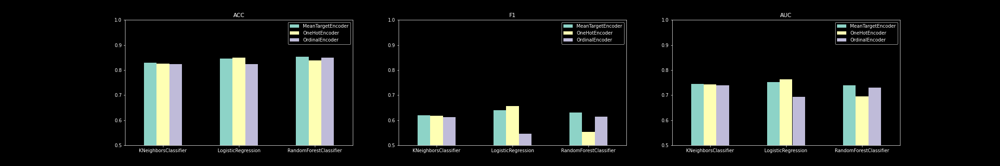

# Testing Mean Target Encoding vs categorical data embeddings
## 1. Goal
**Mean Target Encoding (MTE)** is a technique to transform categorical data into numerical by replacing the categorical value by the mean target value for all observations belonging to that category.  The goal of this project is to benchmark the performance of mean target encoding  against multiple encoding strategies for categorical variables in a structured dataset task.  
The benchmark is run across multiple classification tasks, and considers multiple types of downstream classifiers. Scoring is focused on F1-score and AUC.

## 2. Datasets

### 2.1 Adult Dataset
#### Description
Provides various census features about individuals and aims to predict whether an individual is earning over $50k or not.
[https://archive.ics.uci.edu/ml/datasets/Adult](https://archive.ics.uci.edu/ml/datasets/Adult)

#### Prediction Task
Predict whether an adult's income is higher or lower than $50k, using census information

## 3. Main Findings

Mean Target Encoding seem to be the most resilient encoding strategy to classifer choices and performs best with 2 out of the 3 classifier choices.

## 4. Install Requirements
`conda install -n <name> -f conda.yaml`

## 5. Reproducing Experiments
check out the [notebooks/modeling](notebooks/modeling.ipynb) or run `python main.py`.

## 6. Next Steps

- [x] Add a fourth type of classifiers (LightGBM)
- [ ] Perform comparison on other classification tasks
  - [ ] refactor data loading process into a factory pattern
  - [ ] create a main function taking as input a dataset
  - [ ] add new datasets and compare performances
- [ ] **Categorical data embeddings** is a potentially more expressive generalization of MTE which represents each categorical value as an embedding. embeddings sizes can be defined based on the cardinality of each feature. An embedding of size 1 should replicate closely the principle of MTE (even though values are learnt more indireclty), but weights are learnt instead of explicitly defined.
