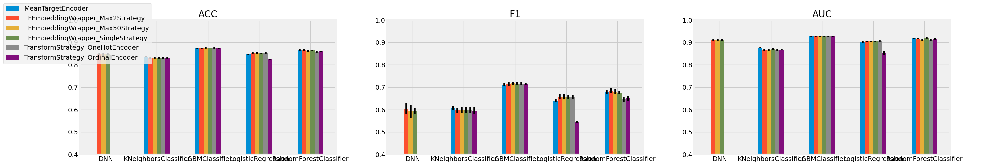

# Benchmark Mean Target Encoding against other Categorical Data Encoding Techniques
## 1. Goal
**Mean Target Encoding (MTE)** is a technique to transform categorical data into numerical by replacing the categorical value by the mean target value for all observations belonging to that category.  The goal of this project is to benchmark the performance of mean target encoding  against multiple encoding strategies for categorical variables in a structured dataset task.  
The benchmark is run across multiple classification tasks, and considers multiple types of downstream classifiers. Scoring is focused on Accuracy, F1-score and AUC.

---
## 2. Tasks

### 2.1 Adult Dataset
Predict whether an adult's income is higher or lower than $50k, using census information given 15 census information.
[https://archive.ics.uci.edu/ml/datasets/Adult](https://archive.ics.uci.edu/ml/datasets/Adult)

### 2.2 Mushrooms Dataset
Aims to predict whether a mushroom is poisonous given 23 categorical descriptors.  
[https://www.kaggle.com/uciml/mushroom-classification#](https://www.kaggle.com/uciml/mushroom-classification#)

### 2.3 Titanic Dataset
Aims to predict whether a Titanic passenger survived given a few descriptors. only some minimal imputing and feature engineering was performed.
[https://www.kaggle.com/uciml/mushroom-classification#](https://www.kaggle.com/uciml/mushroom-classification#)

---
## 3. Main Findings
**Adult Task** 
**Mushrooms Task** 
**Titanic Task** 
Mean Target Encoding seem to be the most resilient encoding strategy to classifer choices and performs best with 2 out of the 4 classifier choices.

---
## 4. Install Requirements
`conda install -n <name> -f conda.yaml`

---
## 5. Reproducing Experiments
### 5.1 through Scripts
Any classification task can be used to evaluate encoder/model pairs as long as the dataset is made available in the `data/` folder, and an identically named python file is added in `src/columnar/loaders`. this file must include 2 functions:
- `_load` describes the steps to load the dataset in memory
- `_select_features(df)` builds a FeatureSelection object describing which features will be fed into the classifier, which ones are categorical, and which column corresponds to the target.

Once this is done, the user can simply run the following command:  
  
  `python main.py --task <task_name>`  

  
This command will generate:
- a CSV report in the `runs/` folder
- a summary figure in the `figures/` folder.
Both new artifacts are named after the prediction task used to evaluate the pipelines.

### 5.2 the Notebook way
check out [notebooks/adult](notebooks/adult.ipynb).

---
## 6. Next Steps

- [x] Add a fourth type of classifiers (LightGBM)
- [ ] Perform comparison on other classification tasks
  - [x] refactor data loading process into a factory pattern
  - [x] create a main function taking as input a dataset
  - [x] add mushrooms dataset and compare performances
  - [x] add titnaic dataset and compare performances
  - [ ] add larger dataset and compare performances

- [ ] **Categorical data embeddings** is a potentially more expressive generalization of MTE which represents each categorical value as an embedding. embeddings sizes can be defined based on the cardinality of each feature. An embedding of size 1 should replicate closely the principle of MTE (even though values are learnt more indireclty), but weights are learnt instead of explicitly defined.
